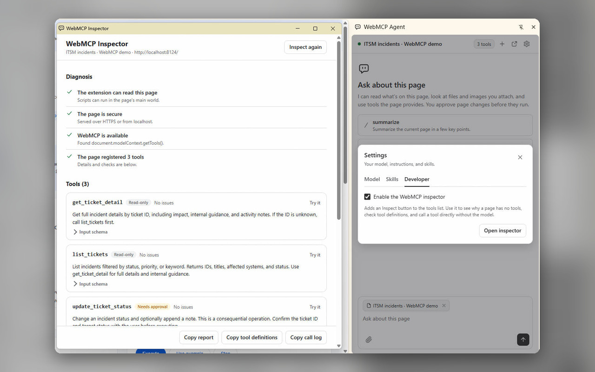
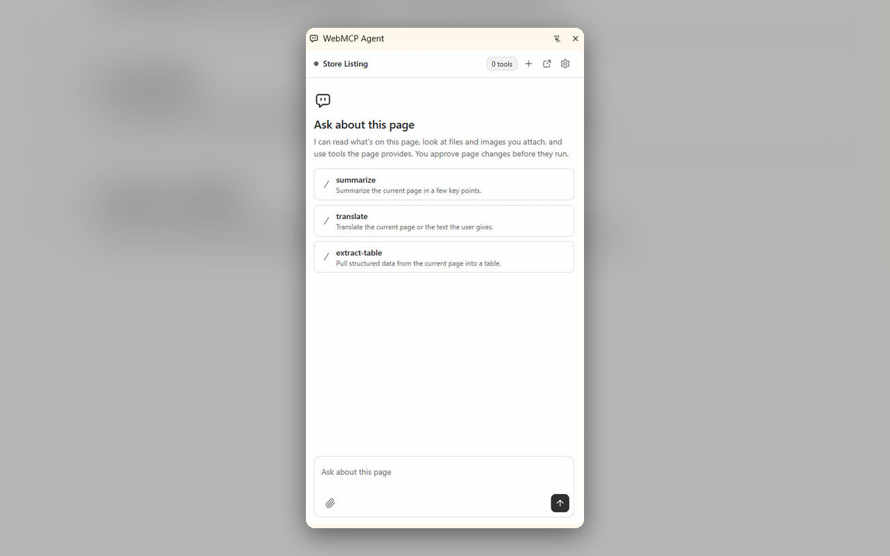
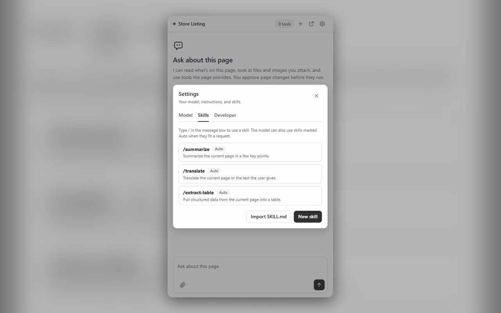
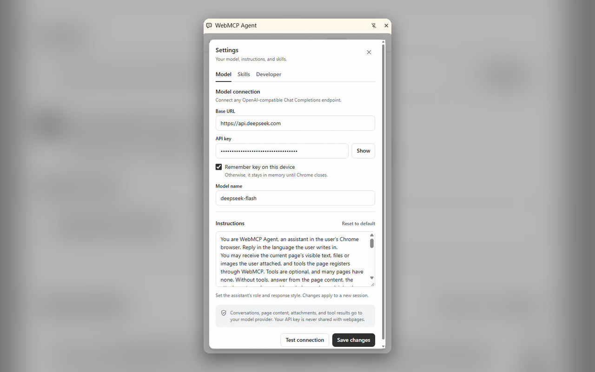

# WebMCP Agent

A general-purpose Chrome assistant for the page you are on. It reads the page, accepts files and images, and uses the page's WebMCP tools when it has them, with a model you configure. It runs in the side panel or a floating window, in English or Simplified Chinese. This is an independent extension, not a Google product.

Version 0.7 draws Mermaid diagrams in answers, in the current theme, with enlarge, zoom, and SVG or PNG download. Version 0.6 added a WebMCP inspector (Settings → Developer): it diagnoses why a page has no tools, checks tool definitions, and calls tools directly without the model. Version 0.5 added skills: saved instructions you pick with `/` or that the model loads when they fit, managed in Settings and compatible with `SKILL.md` files. The floating window now opens in front, pages without tools show their real title, and the model name is no longer shown once configured. Version 0.4 added the floating window, conversations that survive closing the panel and navigating, a dark-grey Chrome-native look with a new icon, and a Chinese interface. See [PRIVACY.md](PRIVACY.md) and [STORE.md](STORE.md) for the privacy policy and Web Store listing.

## Screenshots

The WebMCP inspector next to the agent, with the Developer settings that turn it on:



| Ask about the current page, or start from a skill                                                    | Manage skills                                                                                        |
| ---------------------------------------------------------------------------------------------------- | ---------------------------------------------------------------------------------------------------- |
|  |  |

Connect any OpenAI-compatible model and edit the instructions:



## Install

1. Open `chrome://extensions` and enable **Developer mode**.
2. Choose **Load unpacked** and select this project's `extension` directory.
3. Open any webpage and click the extension's toolbar icon. Pages with WebMCP tools also let the model act on them.
4. Open **Settings**, enter your API key, test the connection, and save.

Default endpoint: `https://api.deepseek.com`. Default model: `deepseek-flash`. Both are editable. No credentials are included in source or release packages.

Already installed? Reload the existing extension on `chrome://extensions`, then close and reopen its side panel. Settings are preserved. An unmodified built-in prompt from an earlier version is replaced with the current default; custom prompts remain unchanged.

## Project layout

- `extension/`: ready-to-load Manifest V3 extension; see its README for details.
- `extension/icons/`: vector icon sources with generated light and dark PNG assets.
- `extension/_locales/`: English and Simplified Chinese UI strings.
- `index.html`: links to the two demos.
- `demo-ops-factory/`: FO Copilot workspace (`fo-tools.js`, `index.html`, `demo.js`, `client.html`). `fo-tools.js` has no UI dependency; a host page supplies `request(operation, payload)`.
- `demo-datadog/`: simulated Datadog MCP server (`datadog-tools.js` and its page) with sample logs, traces, metrics, monitors, hosts, incidents, and dashboards.
- `serve.py`: local server with `Origin-Agent-Cluster: ?1` and a whitelisted `/api` proxy to GDE and Gateway that injects credentials and avoids CORS and certificate errors.
- `tests/`: protocol and browser integration tests.
- `scripts/`: dependency vendoring, icon generation, and visual preview helpers.

## Try the demos

Run `python serve.py 8124` and open `http://127.0.0.1:8124/`.

### Ops Factory

The page calls `serve.py`, which forwards to GDE and Gateway. Create `demo-ops-factory/fo.local.json` (git-ignored), or set the matching `FO_*` environment variables. The server never serves this file, so credentials stay out of the page:

```json
{
  "gdeBase": "https://<gde-host>:38443",
  "gdeUser": "<user>",
  "gdePassword": "<password>",
  "gatewayBase": "http://<gateway-host>:3000",
  "gatewayUser": "<x-user-id>",
  "gatewayKey": "<x-secret-key>"
}
```

Open `http://127.0.0.1:8124/demo-ops-factory/` in a normal browser. GDE sends no CORS headers and uses a self-signed certificate, so the page cannot call it directly; the proxy avoids both. The proxy is read-only by default; start it with `--allow-write` to let write tools (diagnosis, fields, comments, transfer, process, script execution) reach the upstream systems. Restart the server after changing `serve.py` or `fo.local.json`.

### Datadog

Open `http://127.0.0.1:8124/demo-datadog/`. The 10 tools match the Datadog MCP categories (logs and traces, metrics and monitors, hosts, incidents, dashboards) and answer from sample data. Ask: **What is happening with incident 4821, and which span is slow in trace 7f3a2c?**

Ask: **Give me an overview of INC-20260918-0007 and its latest work log, with the MCP call receipt.** Then ask: **Find the diagnostic script for this alarm.** Write tools require approval in the agent. Compare the returned receipt with the page banner.

The page registers 17 tools: 11 read tools (overview, detail, alarms, CSN lookup, operator, priority, paged work logs, BO members, scripts, hosts, paged script results) and 6 write tools. The tools map one `ticketId` to each endpoint's ID field, send `currentInfo` as `originalFieldData`, route long diagnoses through `setAiAttachment`, validate script parameters, run each ticket/script/host job once, and cap successful writes at 8 per ticket per page session. GDE has no list endpoint, so the board loads incidents by ID.

## Development and verification

Run `npm ci`, `npm test`, then `npx playwright install chromium`. With the demo server running, run `npm run test:e2e`.

Browser tests use a temporary independent Chrome for Testing profile. They exercise the extension page and real scripting APIs against native WebMCP, including tool discovery, page text, execution, confirmation/decline, stopping, new sessions, continuing after navigation, session restore, pages without tools, skills (slash menu, manual and automatic use, settings), the inspector (diagnosis, lint, direct calls, tab following), Mermaid diagrams and their failure fallback, and sanitized Markdown. Controlled model responses and mocked `/api` responses make the main suite deterministic and keep it off the live systems. Set the temporary `WEBMCP_TEST_KEY` environment variable for an additional real DeepSeek run; never commit credentials.

Run `npm run vendor` to update packaged runtime libraries. Run `node scripts/icons.mjs` to regenerate PNG icons using installed Chrome, or supply `CHROME_PATH`. No CDN or build server is required at runtime.

UI snapshots are written to `test-results/`. Release archives are published on [GitHub Releases](https://github.com/buyangnie/webmcp-agent-chrome-plugin/releases); build them into `dist/`, which is not tracked.
